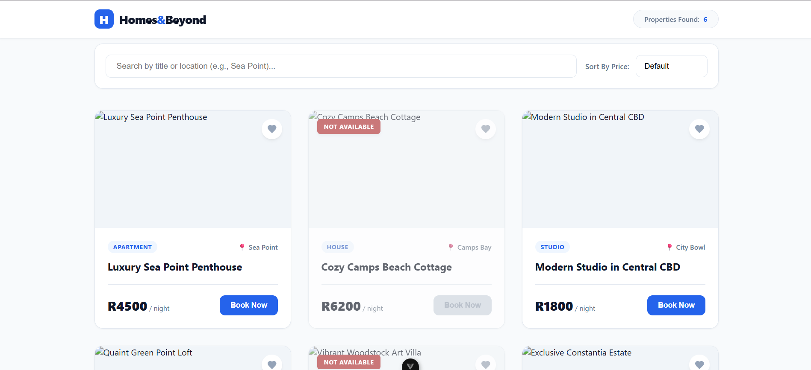

# project-mini-listing-catalogue

## Project Overview

**Homes & Beyond** is a modern, lightweight Single-Page Application (SPA) designed as an interactive real estate catalog showcasing premium rental listings across Cape Town. Built using **Vue 3** and structured with clean, semantic **HTML5** and **Pure CSS**, this prototype demonstrates modular front-end architecture and reactive UI design. 

The application provides users with an instantaneous, fluid property browsing experience without necessitating full page refreshes.

### Key Architectural Features

* **Component-Driven Layout:** Modular architecture featuring decoupled sub-components (`AppHeader` and `PropertyCard`) driven by Vue props and custom event emissions (`$emit`).
* **Reactive Query Filtering:** A fast, live text-matching matrix that scans property titles and geographical locations in real time as the client types.
* **Dual-Engine Price Sorting:** Interactive data organization allowing users to toggle listing arrays seamlessly between low-to-high and high-to-low price vectors.
* **Conditional Visibility Handling:** Dynamic visual state updates, including automated graying matrices and pulsed "Not Available" badge overlays for fully booked units.
* **Persistent Bookmark Tracker:** Seamless integration with the browser's native `localStorage` API, keeping user favorited records intact even after manual page reloads.


## Recommended IDE Setup

[VS Code](https://code.visualstudio.com/) + [Vue (Official)](https://marketplace.visualstudio.com/items?itemName=Vue.volar) (and disable Vetur).

## Recommended Browser Setup

- Chromium-based browsers (Chrome, Edge, Brave, etc.):
  - [Vue.js devtools](https://chromewebstore.google.com/detail/vuejs-devtools/nhdogjmejiglipccpnnnanhbledajbpd)
  - [Turn on Custom Object Formatter in Chrome DevTools](http://bit.ly/object-formatters)
- Firefox:
  - [Vue.js devtools](https://addons.mozilla.org/en-US/firefox/addon/vue-js-devtools/)
  - [Turn on Custom Object Formatter in Firefox DevTools](https://fxdx.dev/firefox-devtools-custom-object-formatters/)

## Customize configuration

See [Vite Configuration Reference](https://vite.dev/config/).

## Project Setup

```sh
npm install
```

### Compile and Hot-Reload for Development

```sh
npm run dev
```

### Compile and Minify for Production

```sh
npm run build
```
